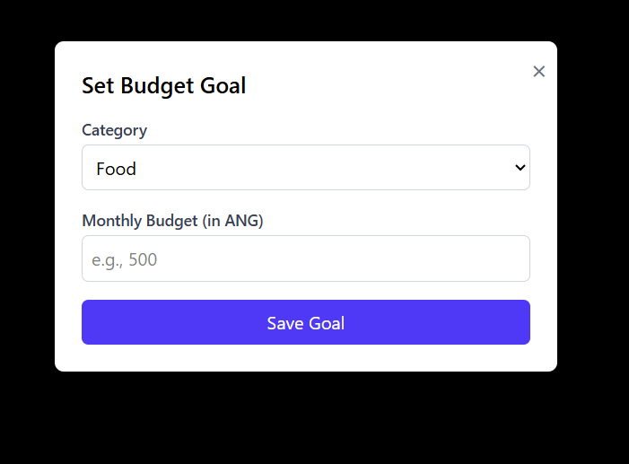

# FinTrack - Personal Finance Tracker 📊

FinTrack is a clean, responsive, and modern web application for tracking personal finances. It allows users to monitor their income, manage expenses, set budget goals, and gain insights into their spending habits through an intuitive and visually appealing interface.

[](https://reactjs.org/)
[](https://redux-toolkit.js.org/)
[](https://tailwindcss.com/)
[](https://vitejs.dev/)

---

## ✨ Key Features

- **Dashboard Overview**: Get an at-a-glance summary of your total income, expenses, and savings for different time periods (weekly, monthly, yearly).
- **Expense Visualization**: A dynamic pie chart and detailed progress bars show you exactly where your money is going.
- **Transaction Management**: Easily add, edit, and delete income or expense transactions through a user-friendly modal.
- **Multi-Currency Support**: Input transactions in any currency and set a global display currency for all values in the app, with real-time conversion rates.
- **Dynamic Budgeting**: Set monthly spending goals for various categories and visually track your progress.
- **Fully Responsive Design**: A seamless experience on desktop, tablet, and mobile devices with a collapsible navigation sidebar.

---

## 🚀 Live Demo & Deployment

This project is ready for deployment on **Vercel**.

[**[Your Live Demo Link Will Go Here]**](#)

[](https://vercel.com/new/clone?repository-url=https%3A%2F%2Fgithub.com%2Fyour-username%2Fyour-repo-name)

_(Remember to replace the repository URL in the button link above with your own GitHub repository URL)_

---

## 📸 Project Preview

Here's a glimpse of FinTrack in action:

**Stats Dashboard**
_Displays a summary of your finances and a breakdown of expenses._


**Transactions Page**
_A clean list of all your income and expense entries._


**Add/Edit Transaction Modal**
_Quickly add or update a transaction with all necessary details._


**Budget Tracking**
_Set goals and track your spending against your budget in real-time._


**Set Budget Goal Modal**
_Easily define your monthly spending limits for any category._


**Multi-Currency Settings**
_Change your preferred display currency, and all values will be converted instantly._


---

## 🛠️ Technologies Used

- **React.js**: For building the user interface.
- **Vite**: As a fast and modern build tool.
- **Tailwind CSS**: For utility-first styling and responsive design.
- **Redux Toolkit**: For efficient and predictable global state management.
- **RTK Query**: For handling API requests to the currency exchange service, including caching and loading states.
- **Recharts**: For creating beautiful and interactive charts.

---

## ⚙️ Getting Started

To run this project locally, follow these steps:

1.  **Clone the repository:**

    ```bash
    git clone [https://github.com/your-username/your-repo-name.git](https://github.com/your-username/your-repo-name.git)
    ```

2.  **Navigate to the project directory:**

    ```bash
    cd your-repo-name
    ```

3.  **Install dependencies:**

    ```bash
    npm install
    ```

4.  **Set up your environment variables:**

    - Create a new file named `.env` in the root of your project.
    - Add your API key from [ExchangeRate-API](https://www.exchangerate-api.com/) to this file.

    ```
    VITE_Exchange_API_KEY=your_actual_api_key_here
    ```

5.  **Run the development server:**
    ```bash
    npm run dev
    ```
    The application will be available at `http://localhost:5173` (or another port if 5173 is busy).

---

## ☁️ Deployment on Vercel

Deploying this application is straightforward:

1.  Push your completed project to a GitHub repository.
2.  Go to your [Vercel dashboard](https://vercel.com/dashboard) and click "Add New... > Project".
3.  Import your GitHub repository.
4.  In the project settings, go to the "Environment Variables" section and add your API key:
    - **Name:** `VITE_Exchange_API_KEY`
    - **Value:** `your_actual_api_key_here`
5.  Click "Deploy". Your site will be live in a few moments!
